class: center, middle

# Laboratoire d'Aix-périmentation de Bidouille 
## Fab Lab, Créativité et Numérique 
### Sébastien NEDJAR (MCF AMU - LIF)
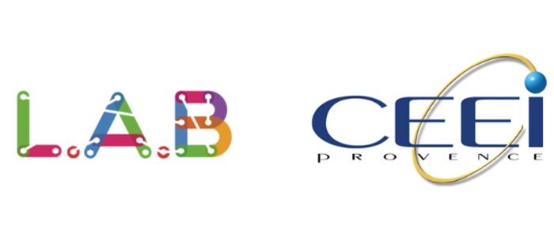
---

# Disclaimer
Cette présentation se veut non sérieuse et pourra donc contenir du second degré et de 
l'humour de qualité discutable. Veuillez ne pas jeter des tomates (ou tout autre objet) sur l'orateur s'il heurte par moment votre sensibilité.
---

# À propos
- Sébastien NEDJAR (@nedseb)

---

# À propos
- Sébastien NEDJAR (@nedseb)
    + Maître de conférences au Département Info de l'IUT  d'Aix. Enseignant spécialiste des Bases de données et chercheur en OLAP Mining au LIF.

    + Membre fondateur du Fab Lab Provence et du Laboratoire d'Aix-périmentation et de Bidouille.
    
    + Co-animateur de l'ICSTUG #Iutagile.

    + Organisateur des rencontre Beyond Lab.
    
    + Et bien d'autres activités surprenantes.
---
class: center, middle
#Fab Lab
---
## Génèse du DIY
  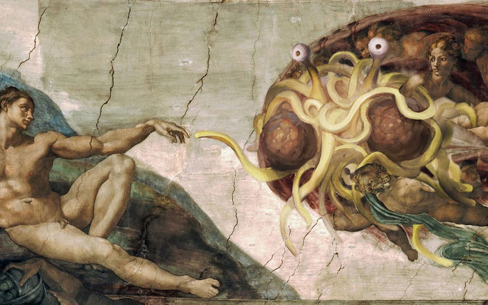
---

## De l'Open Source à l'Open Hardware
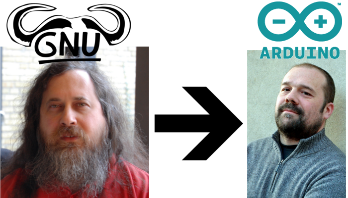
---

## Maker
- Une personne qui pratique le DIY. Elle fabrique ses propres outils/instruments/objets en s'appuyant sur une communauté avec qui elle partage ses projets.

- L'objectif de ce partage est de rendre à la communauté l'aide qu'elle nous a apporté.

- L'effet de levier apporté par les briques mises à disposition de la communauté permet une convergence rapide des projets.

- Moteur de ce que certains appellent la troisième révolution industrielle.
---

## Makers
  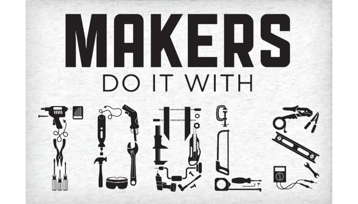
---

## Makers
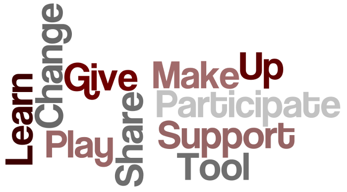
---

## MakerSpace/Hackerspace/Fab Lab ?

- Lieux ouverts, communautaires et collaboratifs

- Mise en commun de ressources et d'outils

- Réalisation de projets variés :
    - Conception d'objets
    
    - Installation technico-artistiques
    
    - Réparation et détournement d'objets
    
    - Et bien pire encore

- Échange de compétences.
---

## Laboratoire d'Aix-périmentation et de bidouille

- Fab Lab ouvert à tous (*i.e* même à moi pour vous dire),

- Une communauté de Makers avec des profils très variés (Ingénieurs, Enseignants, Chercheurs, Étudiants, Hobbyistes, passionnés, ... ),

- Soirées mensuelle l'avant dernier vendredi du mois (présentation des projets, conférences, ateliers bidouille et malbouffe),

- Notre credo : être un Fab Lab qui essaime la philosophie des makers sur tout le territoire provençal.

.center[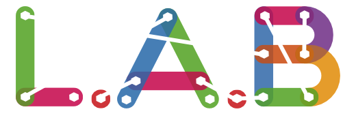]
---

## Laboratoire d'Aix-périmentation et de bidouille
- Gérer un atelier offrant au public et tout particulièrement aux adhérents du lieu des outils de fabrication numérique;

- Promouvoir l’expérimentation par la pratique et la réalisation de projets au moyen d’outils mis à disposition dans l’atelier, que ces projets aient une vocation scientifique, technique, artistique, culturelle ou économique;

- Agir pour la promotion des sciences et techniques auprès du grand public en organisant et participant à des événements et en accueillant tout visiteur et en lui offrant des opportunités de s’investir auprès de l’association;

- Favoriser la transmission et les échanges de savoir-faire et de connaissances;
---

## Laboratoire d'Aix-périmentation et de bidouille
- Promouvoir l’usage et les contributions à l’informatique, au matériel et aux contenus Libres;

- Promouvoir la ré-appropriation par le grand public des capacités d’analyse, de conception, de fabrication et de modification d’objets technologiques, c’est-à-dire la « bidouillabilité »;

- Proposer aux entreprises locales, associations et institutions des services favorisant leur développement;

- Entretenir des réseaux de relations destinés à la création d’entreprises et d’opportunités commerciales sur la base des projets réalisés au sein de l’association.
---

# Open Bidouille Camp Provence
L’Open Bidouille Camp Provence est un événement géré par la communauté du Fab Lab Provence visant à offrir une tribune aux « Makers » du Sud de la France. 

C’est aussi une ode à l’invention, la créativité, la mise en commun des ressources, ainsi qu’une célébration du mouvement des « Makers » !

Il a lieu le 27 & 28 mai prochain à la Bibliothèque Méjanes au centre d'Aix-en-Provence.

.center[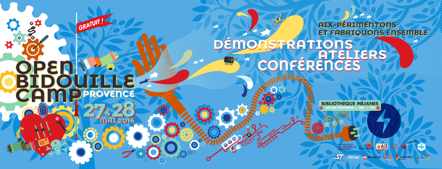]

---
# Open Bidouille Camp Provence
.center[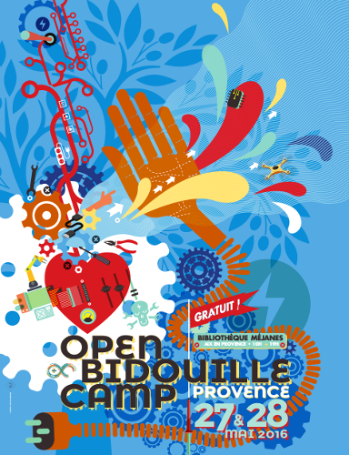]
---

# Open Bidouille Camp Provence

 - L’Open Bidouille Camp Provence est une petite foire de la fabrication numérique et du DIY. 
 
 - Elle célèbre le « faites-le-vous-même », la science et la technologie, la robotique, l’artisanat moderne et la musique. 
 
 - L’événement est organisé dans le cadre de la French Tech Aix-Marseille par une équipe motivée par le mouvement international des « Makers ». 
 
 - C’est l’occasion de venir présenter vos projets ou de découvrir les inventions et créations de passionnés du « Do It Yourself » qui seront présentés. 

---

# Open Bidouille Camp

Différents thèmes y sont abordés : 

 - Créativité
  
 - Electronique/Informatique, 
 
 - Robotique, 
 
 - Citoyenneté, 
 
 - Développement durable,
  
 - Logiciels libres...
 
L’esprit de cette manifestation est de permettre aux participants de retrouver un peu d’autonomie, de liberté de choix en se réappropriant le numérique par le faire. 

---

# Open Bidouille Camp

- **OPEN** :
  comme dans logiciel libre, partage de connaissances, libre de droits, codes sources

- **BIDOUILLE** : 
  comme dans faire par soi-même, détourner de son usage, bricoler, apprendre, fabriquer, expérimenter

- **CAMP** : 
  parce qu’on s’installe sur la place publique, on va à la rencontre des gens, on fait ensemble en ateliers 
  dans ce campement improvisé. Tout le monde est invité à participer.
---
# Open Bidouille Camp Provence
.center[]
---

class: center, middle

# How to make (almost) anything

---

# How to make (almost) anything
.center[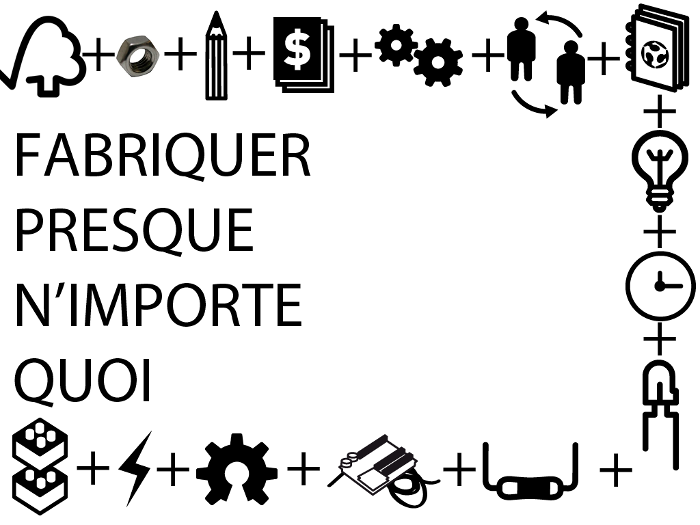]
---

## Du Mobilier Open Source
.center[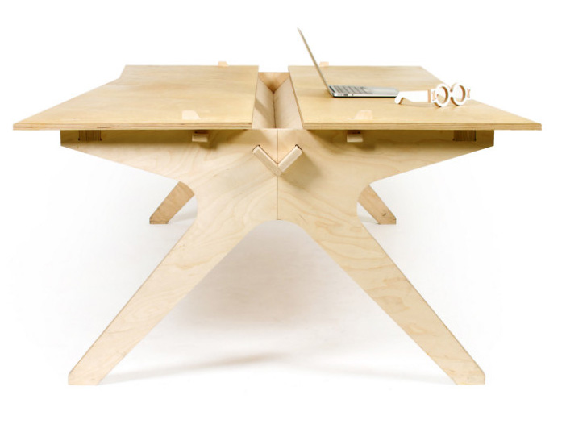]
---

## Du Mobilier Open Source
.center[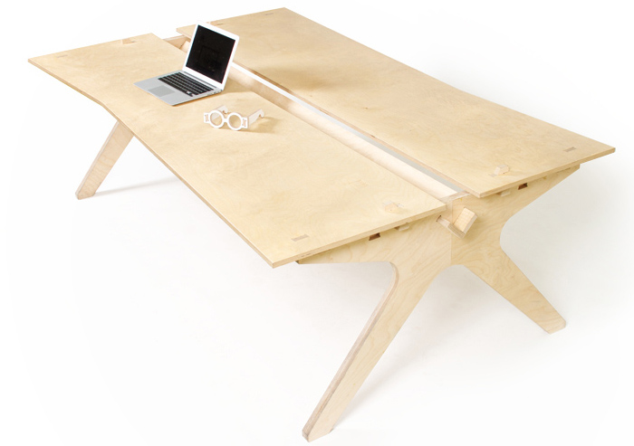]
---

## Du Mobilier Open Source
.center[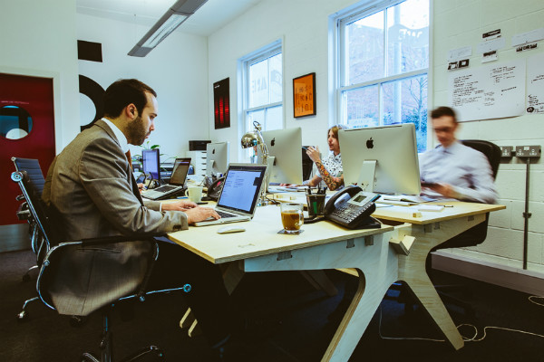]
---

## Une Maison Open Source
.center[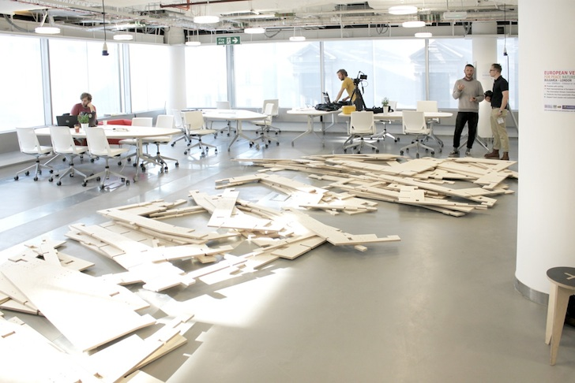]
---

## Une Maison Open Source
.center[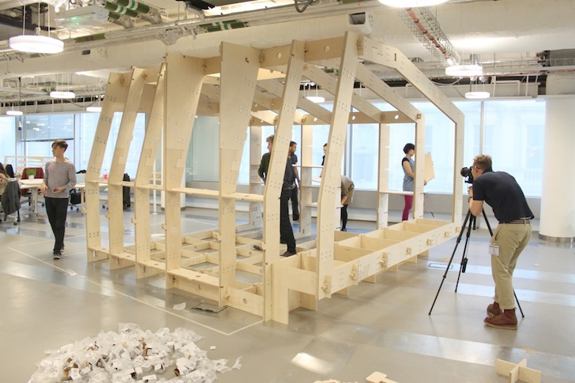]
---

## Une Maison Open Source
.center[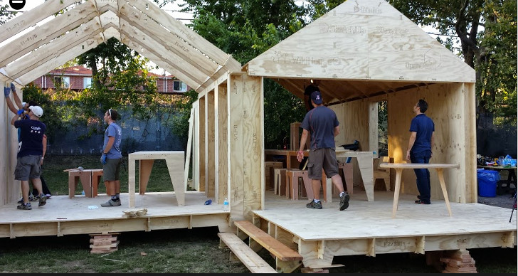]
---

## Une Maison Open Source
.center[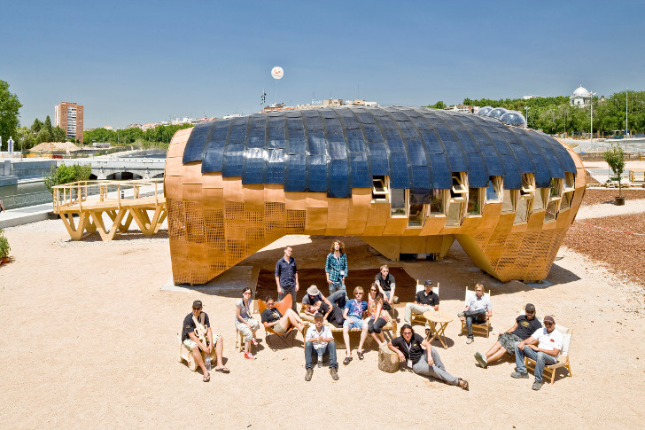]
---

## Un village ?
.center[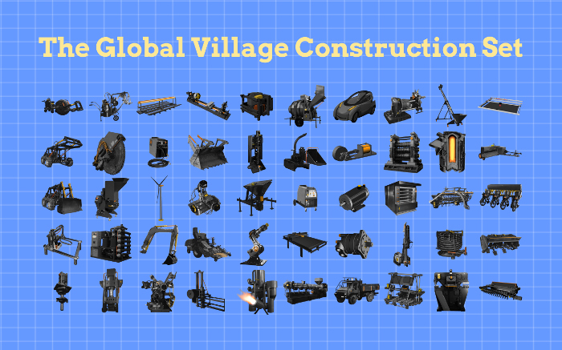]
---

## Un village ?
.center[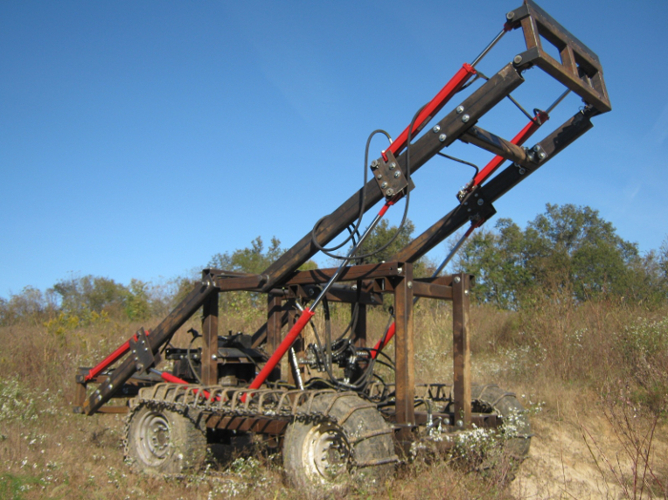]
---

class: center, middle

# Quel est l'intérêt pour une entreprise ?
---

# Un mode de fonctionnement
- Collaboratif

- Horizontalité

- Auto-organisation

- Transversalité

- Émergence
---

# Des valeurs humaines
- Confiance

- Ouverture

- Courage et acceptation du changement

- Des humains d'abord
---

# Des pratiques
- Releaser au plus tôt

- Feed Back de la communauté

- Amélioration continue

- Cycles courts/itérations
---

# Fail Fast, Fail Often
- Démocratisation des outils

- Démocratisation du risque

- Échouons souvent pour un jour réussir

- Ticket d'entrée plus faible pour l'innovation

- La vraie révolution est dans la démocratisation de l'innovation.
---

class: center, middle
# Les « stars » de la fabrication numérique
---

class: center, middle
# Fabrication numérique, travail collaboratif et décloisonnement
---
